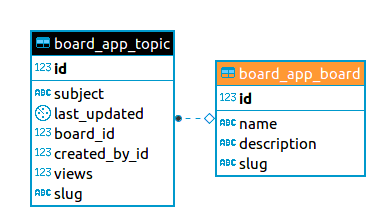
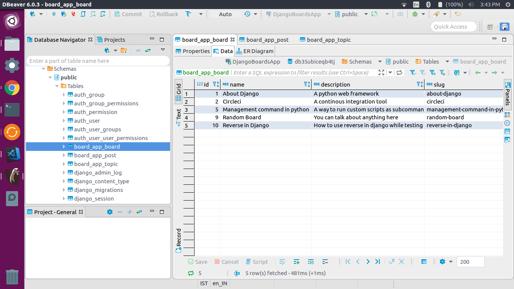
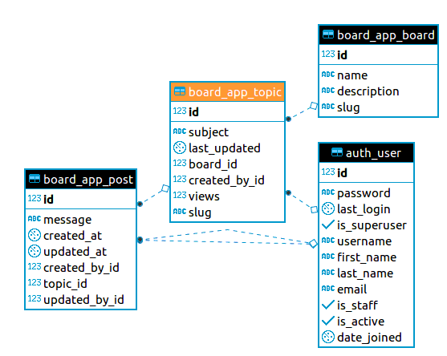
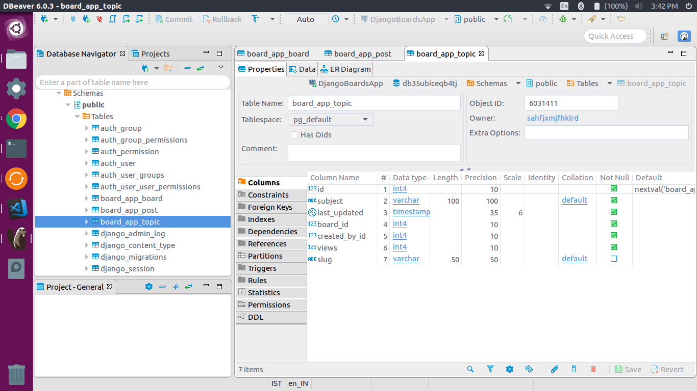
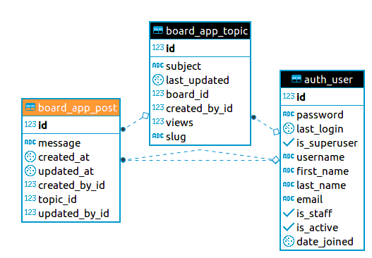
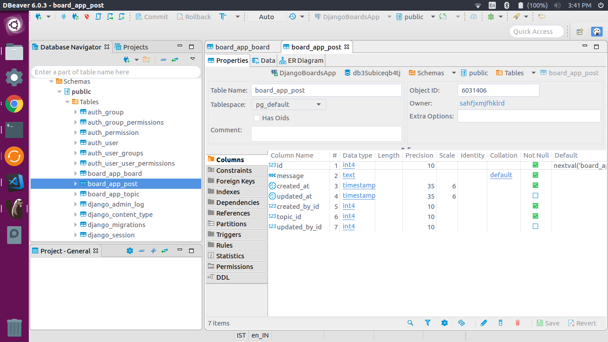
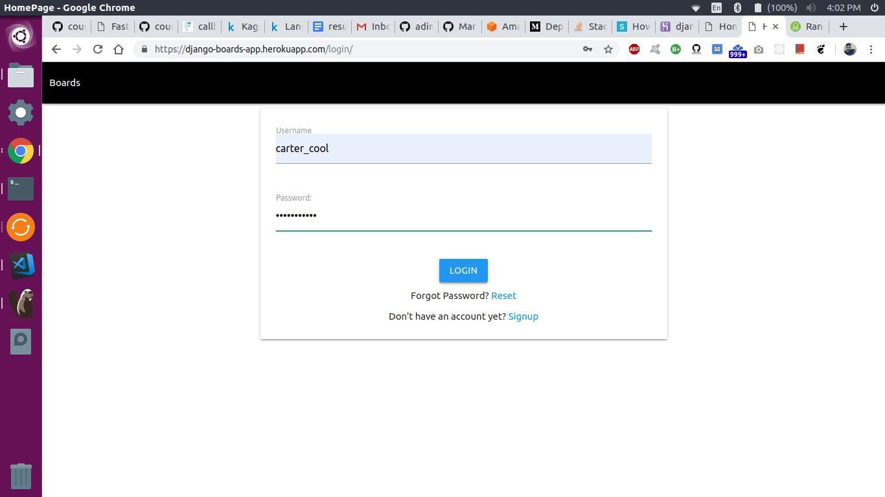
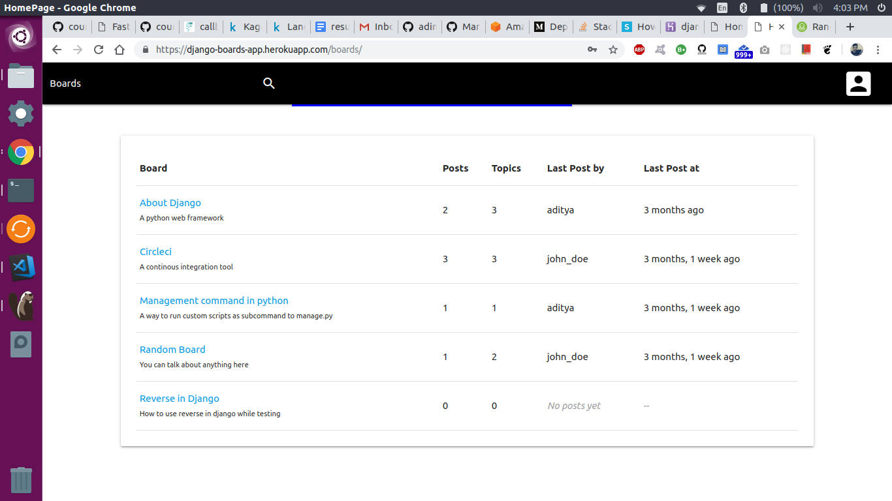
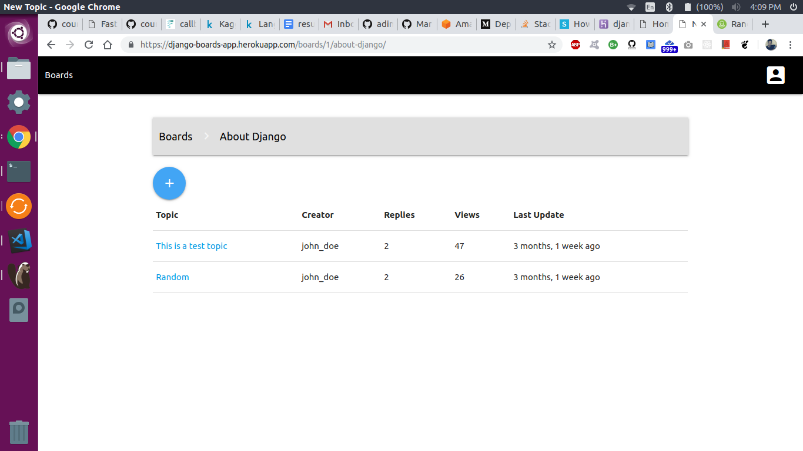
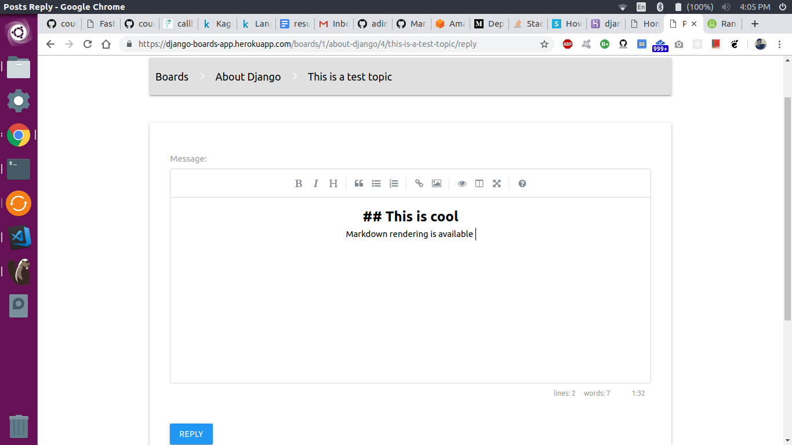

# Boards App
A simple Django app. Checkout the app [here](https://django-boards-app.herokuapp.com/boards)

## Key Features
* Authentication
* Login/Signup forms
* Markdown editing
* Search for a board
* Creating or editing a topic
* Creating or editing a post
* Alphabetically sorted boards 
* Posts are sorted by timestamp

## Tech stack
* Django 
* Materialize CSS
* Heroku (deployment)

## Database Structure
There are 3 main components in the app 
* Board - A board is a general banner under which there can be different topics eg Python
* Topic - A topic comes under a board & talks about a specific aspect eg Django Development, Locust
* Post - A post is made by a user for a topic

### Board table
ER Diagram



Example


### Topic table
ER Diagram



Example



### Post table
ER Diagram



Example


**For more details, check the models.py file**

## Running the app locally
#### Installing database
Here, we install postgres database and pyscopg2 which is a python based postgresql driver which allows us to create sessions, destroy them, fetch data, etc from a postgres database easily.

```bash
sudo apt install python3-dev postgresql postgresql-contrib python3-psycopg2 libpq-dev
```

#### Installing python dependencies
Creating a python environment
```bash
conda env create -f environment.yml
conda actiate boards
```

#### Creating .env file
`.env` files are created to contain all the sensitive information like username, password, database url, etc during the deployment stage. It is a good habit not to push these information to github or make it available to anyone. So, we create a `.env` file for both local development & production deployment seperately. For more details, refer this [article](https://simpleisbetterthancomplex.com/2015/11/26/package-of-the-week-python-decouple.html)
```python
DATABASE_URL=postgres://db_user:db_password@db_host:db_port/db_name
DB_HOST=db_host # host_url
DB_NAME=db_name # database name
DB_PASSWORD=db_password # database password
DB_PORT=db_port # database port number
DB_USER=db_user # database username
DEBUG=False
DEFAULT_FROM_EMAIL=johndoe@gmail.com # email id
DISABLE_COLLECTSTATIC=1
EMAIL_HOST_PASSWORD=password # email password 
EMAIL_HOST_USER=johndoe@gmail.com # email id
SECRET_KEY=django_app_secret_key_string # app secret key
``` 

#### Running the app
```
python manage.py runserver
```
In your browser, navigate to this [link](http://localhost:8000/boards)


## Screenshots

#### Login


#### Boards Page


#### Topics Page


#### Markdown editor & rendering



Please, **star** the project if you like it. Do create a pull request if there's something that you can add.

Kindly, contact me, if you want to use this project.